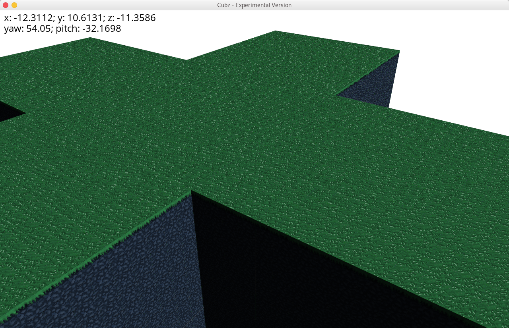
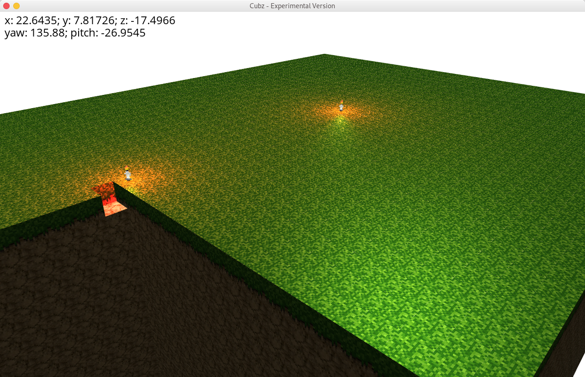
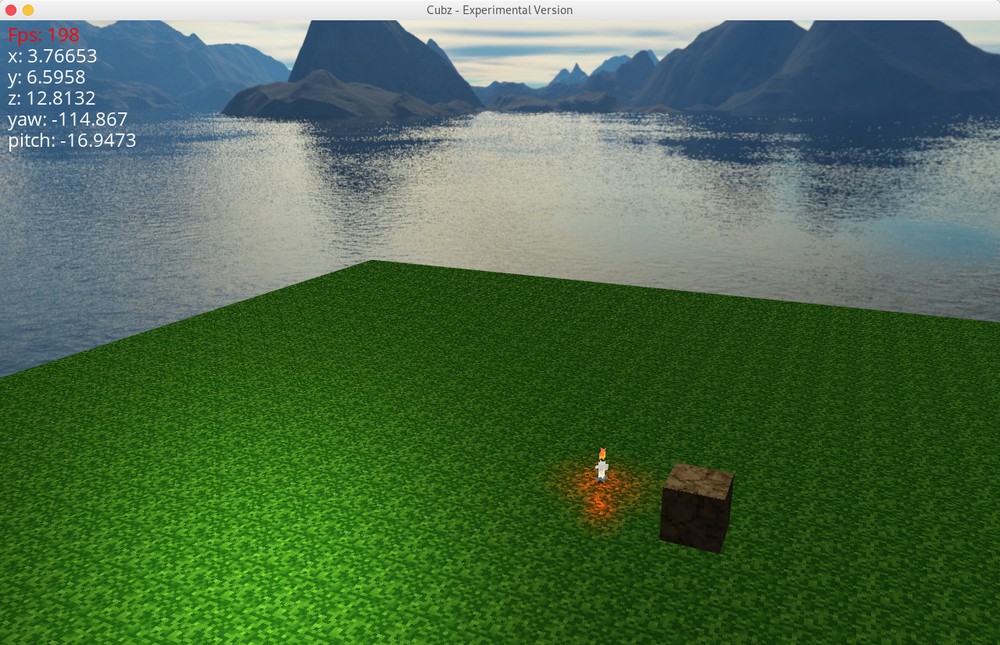

# Cubz - Game Engine
Currently under development!!
Currently broken

## Features:
- Render systems
- Entity component systems
- OpenGL wrapper
- Higher Level Graphics Abstractions

## Example usage

```
#include <core/Engine.h>
#include <utility/Log.h>
#include <graphics/Mesh.h>
#include <graphics/MeshRenderer.h>
#include <graphics/BasicComponents.h>
#include <graphics/ui/DebugView.h>


int main(int argc, char **argv) {
    auto engine = cubz::core::Engine();

    try {
        auto context = engine.createContext(800, 600, "Test Window");
        auto ecs = engine.createEntityComponentSystem();
        auto camera = engine.createCamera();
        auto resourceManager = engine.createResourceManager("./assets");
        auto meshRenderSystem = engine.createMeshRenderSystem();

        auto cube = ecs->createEntity();
        auto transform = cubz::graphics::Transform {
                { 0, 0, -1 },
                glm::mat4(1.0),
                { 1, 1, 1 },
        };

        auto mesh = cubz::graphics::Mesh();
        const auto size = 10;
        mesh.addVertex({ -size, size, -size });
        mesh.addVertex({ size, size, -size });
        mesh.addVertex({ size, -size, -size });
        mesh.addVertex({ -size, -size, -size });
        mesh.addQuadTriangles();

        auto renderer = cubz::graphics::MeshRenderer(
            resourceManager->getShader("cube"),
            cubz::graphics::opengl::Material{
                resourceManager->getTexture("terrain.png"),
                { 1, 1, 1 },
                32
            });

        ecs->addComponent<cubz::graphics::Mesh>(cube, mesh);
        ecs->addComponent<cubz::graphics::Transform>(cube, transform);
        ecs->addComponent<cubz::graphics::MeshRenderer>(cube, renderer);

        context->setClearColor({ 1, 1, 1 });


        while (!context->windowClosed()) {
            context->clear();
            meshRenderSystem->update(context->getDeltaTime());
            meshRenderSystem->render(*camera);
            context->render();
        }
    } catch (std::exception& e) {
        cubz::utility::Log::error(e);
        return 1;
    }

    return 0;
}
```

Older samples:




## Build Instructions
This project uses hunter, an open-source cmake package manager.
To make this project work, no additional libraries need to be downloaded since hunter will do that job for you.

Currently this project only renders a sample scene, but it will be converted to a fully usable cmake library soon

### 1st Step - Run cmake
```
$ cd Cubz
$ cmake .
```
Please be patient if you load the cmake file the first time; many libraries need to be downloaded and built, and this can take quite some time.

### 2nd Step - Run make
```
$ make cubz
```

### 3rd Step - Run cubz
```
$ cd ..
$ cd cubz-build
$ ./cubz
```
