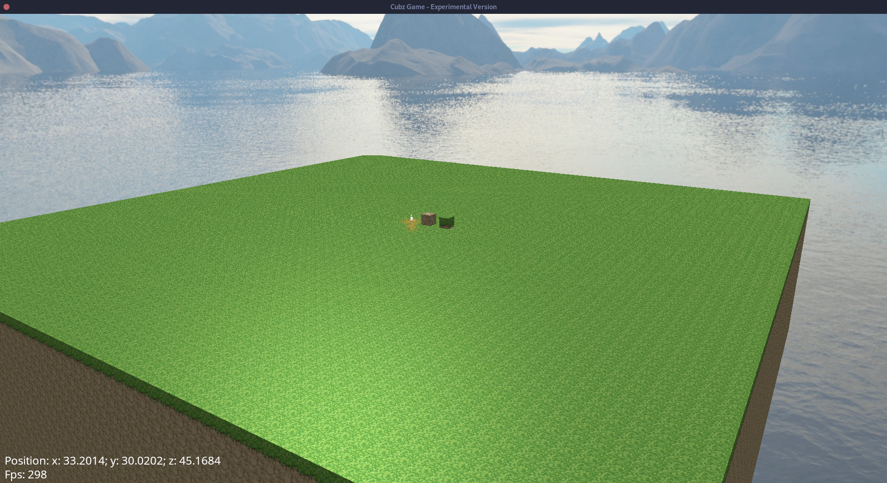
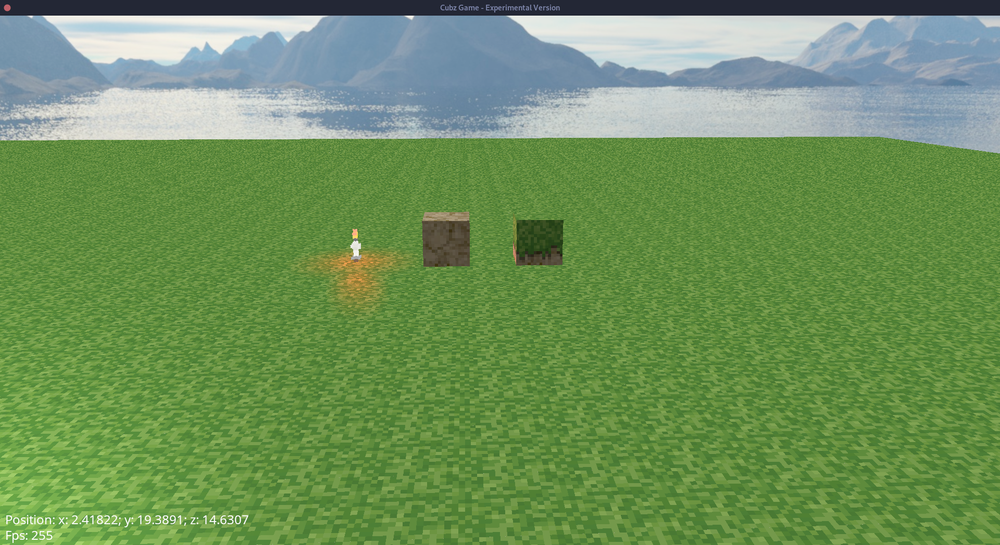
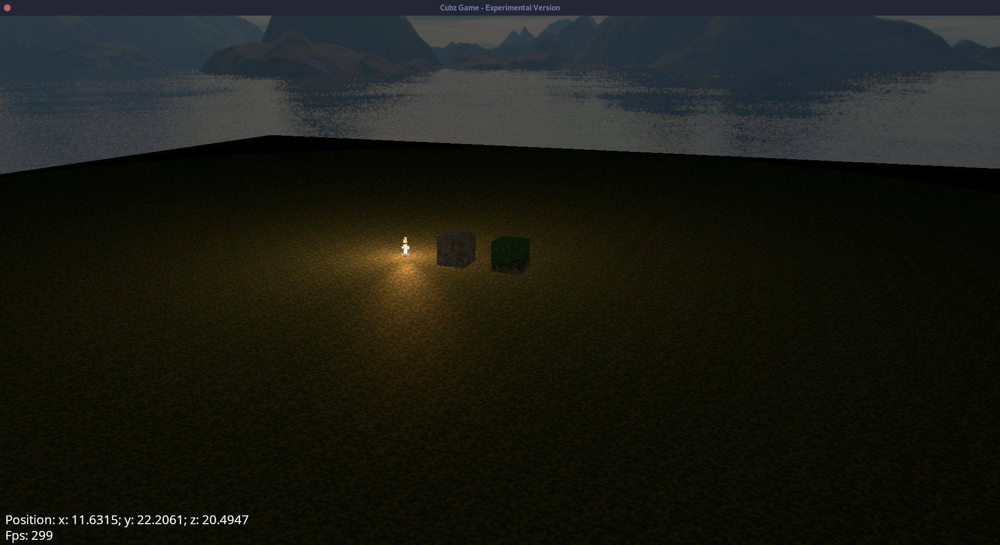

# Cubz - High Performance ECS Game Engine

## Features:
- Fast Render systems
- Entity component system
- OpenGL wrapper
- Higher Level Graphics Abstractions
- Shaders
- Textures
- Text Rendering
- and more...

## Example usage

```
#include <core/Engine.h>
#include <utility/Log.h>


int main(int argc, char **argv) {
    auto engine = cubz::core::Engine();

    try {
        auto context = engine.createContext(800, 600, "Test Window");

        while (!context->windowClosed()) {
            context->clear();
            context->render();
        }
    } catch (std::exception& e) {
        cubz::utility::Log::error(e);
        return 1;
    }

    return 0;
}
```

Cubz-Game Sample Pictures:

Those fps numbers are actually achieved by my integrated notebook graphics chip.
If you have a reak graphics card, expect the framerate to be much higher




## Build Instructions
This project uses hunter, an open-source cmake package manager.
To make this project work, no additional libraries need to be downloaded since hunter will do that job for you.

Currently this project only renders a sample scene, but it will be converted to a fully usable cmake library soon

### 1st Step - Run cmake
```
$ cd Cubz
$ cmake .
```
Please be patient if you load the cmake file the first time; many libraries need to be downloaded and built, and this can take quite some time.

### 2nd Step - Run make
```
$ make cubz
```

### 3rd Step - Run cubz demo game
```
$ cd ..
$ cd cubz-build
$ ./cubz-game
```
