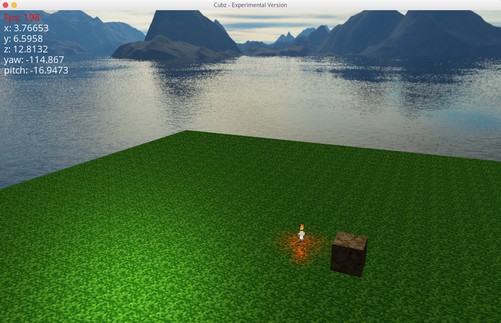

# Cubz - Voxel Engine
Currently under development!!




## Build Instructions
This project uses hunter, an open-source cmake package manager.
To make this project work, no additional libraries need to be downloaded since hunter will do that job for you.

Currently this project only renders a sample scene, but it will be converted to a fully usable cmake library soon

### 1st Step - Run cmake
```
$ cd Cubz
$ cmake .
```
Please be patient if you load the cmake file the first time; many libraries need to be downloaded and built, and this can take quite some time.

### 2nd Step - Run make
```
$ make cubz
```

### 3rd Step - Run cubz
```
$ cd ..
$ cd cubz-build
$ ./cubz
```